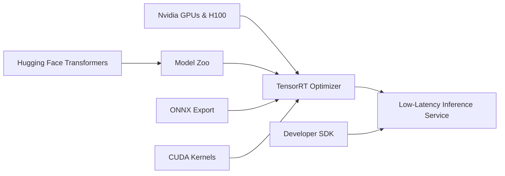

*By [Your Name]*  

---

## Introduction  

The AI landscape is shifting at a breakneck pace, and the latest buzz centers on Nvidia’s reported move to acquire Hugging Face. While the headline grabs attention, the real story lies in the strategic ripple effects this deal could generate across hardware, software, and the broader AI community. In this post we’ll unpack the motivations behind the acquisition, explore how it could reshape the AI stack, and consider the opportunities and challenges that lie ahead for developers, enterprises, and regulators.

---  

## 1. Why Nvidia Wants Hugging Face  

### 1.1 Closing the Hardware‑Software Loop  

Nvidia has built its empire on GPUs that power everything from gaming to deep learning. Yet, as models become larger and more specialized, the value of tightly coupling hardware with the software that runs on it has grown dramatically. By bringing Hugging Face—home to the world’s most popular open‑source model hub—under its umbrella, Nvidia can:

- **Optimize inference pipelines** directly on its own GPUs and upcoming AI‑specific accelerators.  
- **Streamline model deployment** with pre‑tuned kernels that exploit Nvidia’s Tensor Cores.  
- **Offer end‑to‑end performance guarantees**, a compelling selling point for enterprises that need predictable latency.

### 1.2 Expanding the Ecosystem Play  

Hugging Face isn’t just a repository; it’s an entire ecosystem that includes:

- **Transformers library** (the de‑facto standard for NLP, vision, and multimodal models).  
- **Inference API** that abstracts away infrastructure concerns.  
- **Training and fine‑tuning tools** such as `accelerate` and `peft`.  

Acquiring this stack gives Nvidia a ready-made developer community, turning the company from a hardware vendor into a full‑stack AI platform provider.

### 1.3 Capturing the “Foundation Model” Market  

Foundation models—large, pre‑trained networks that can be adapted to countless downstream tasks—are becoming the new commodity. Companies that can efficiently host, fine‑tune, and serve these models will command a sizable share of AI spend. Nvidia’s acquisition could lock in a dominant position in this emerging market.

---  

## 2. Technical Synergies: What Could Change Under the Hood  

Below is a high‑level view of how Nvidia and Hugging Face could integrate their technologies.

**Key integration points:**

| Area | Current State | Potential Integration |
|------|---------------|-----------------------|
| **Model Optimization** | TensorRT supports generic ONNX models; developers manually convert Hugging Face models. | Direct pipelines that auto‑convert Transformers to TensorRT‑optimized graphs, preserving quantization and sparsity. |
| **Training Acceleration** | Hugging Face `accelerate` can target Nvidia GPUs, but requires manual configuration. | Tight coupling with Nvidia’s cuDNN and newer **Transformer Engine** to automatically select mixed‑precision strategies. |
| **Deployment** | Inference API runs on cloud VMs or custom servers; latency varies. | Dedicated **Nvidia AI Cloud** offering guaranteed sub‑millisecond response times for popular models. |
| **Observability** | Basic metrics via Prometheus. | Integrated profiling tools that expose GPU utilization, memory bandwidth, and kernel efficiency in real time. |

These synergies could dramatically lower the barrier to entry for companies that want to leverage state‑of‑the‑art models without building a specialized AI infrastructure team.

---  

## 3. Implications for the Open‑Source Community  

### 3.1 A Double‑Edged Sword  

Hugging Face has championed openness, allowing researchers to publish models under permissive licenses. An Nvidia acquisition raises concerns:

- **Potential for proprietary lock‑in:** If Nvidia prioritizes its own hardware, developers might see reduced performance on competing platforms.  
- **Risk of slower open‑source releases:** Corporate priorities could delay community‑driven updates.

However, Nvidia has a track record of supporting open‑source projects (e.g., CUDA‑based libraries, the Triton Inference Server). If the company continues that approach, the partnership could:

- **Accelerate innovation** by providing better tooling and funding for core libraries.  
- **Increase funding for community events** such as conferences and hackathons.

### 3.2 Licensing and Model Governance  

The acquisition may prompt a reevaluation of licensing models. Hugging Face currently hosts models under a mixture of Apache 2.0, MIT, and custom licenses. Nvidia might push for:

- **Standardized commercial licenses** for enterprise‑grade models.  
- **More robust governance** to prevent misuse of powerful models (e.g., deep‑fakes, disinformation).

A transparent, community‑involved process will be crucial to maintain trust.

---  

## 4. Market Dynamics: Winners, Losers, and New Players  

| Stakeholder | Potential Gains | Potential Risks |
|-------------|----------------|-----------------|
| **Enterprise AI teams** | Faster time‑to‑value, guaranteed performance on Nvidia hardware. | Higher cost if forced into Nvidia‑centric stacks. |
| **Startups building AI SaaS** | Access to a unified platform for model serving, reducing ops overhead. | Dependence on Nvidia pricing and roadmap. |
| **Competing GPU vendors (AMD, Intel)** | May spur them to double‑down on open‑source tooling. | Could lose market share if Nvidia’s integrated stack becomes the default. |
| **Cloud providers** | Ability to offer “Nvidia‑Optimized Hugging Face” services as a premium tier. | Pressure to renegotiate pricing with Nvidia. |
| **Open‑source contributors** | Increased resources for library maintenance. | Possible shift toward Nvidia‑centric development, limiting hardware diversity. |

The acquisition could also catalyze **new business models**—for instance, “model‑as‑a‑service” bundles that combine GPU time, model licensing, and fine‑tuning support under a single subscription.

---  

## 5. Regulatory and Ethical Considerations  

### 5.1 Antitrust Scrutiny  

Nvidia already dominates the GPU market for AI workloads. Adding a pivotal software layer could raise antitrust
