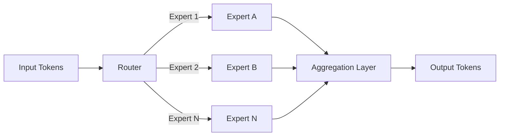

*By [Your Name]*  

*Published: August 28 2026*  

---

## Introduction  

When TechCrunch Disrupt announced that Anthropic and OpenAI would co‑host a dedicated AI stage at this year’s conference, the tech community took notice. Two of the most influential players in the generative AI ecosystem sharing a platform is more than a scheduling convenience—it’s a signal of where the industry is heading. In this post we’ll unpack the strategic, technical, and market implications of this partnership, explore how it reshapes the competitive landscape, and consider what it means for developers, investors, and policymakers alike.

---

## 1. Why the Joint Stage Matters  

### 1.1 A Shift From Rivalry to Collaboration  

Historically, Anthropic and OpenAI have been positioned as rivals, each vying for leadership in large‑language models (LLMs) and safety research. By co‑curating an AI stage, they are:

- **Acknowledging shared challenges** such as alignment, hallucination mitigation, and responsible deployment.
- **Pooling resources** to showcase best practices rather than competing for headline‑grabbing demos.
- **Sending a market signal** that the next wave of AI innovation will be driven by standards and interoperability, not just raw model size.

### 1.2 Elevating the “AI‑First” Narrative  

TechCrunch Disrupt is a launchpad for emerging startups. Placing Anthropic and OpenAI at the heart of the event reinforces the notion that AI is no longer a niche tool—it’s a foundational layer for product development, infrastructure, and even business strategy.

---

## 2. Technical Takeaways From the Stage  

### 2.1 Model Architecture Convergence  

Both companies highlighted a move toward **mixture‑of‑experts (MoE) transformers** that dynamically allocate compute across specialized subnetworks. This approach offers:

- **Scalability**: Larger effective model capacity without proportional increase in inference latency.
- **Efficiency**: Lower energy consumption per token, a key metric as sustainability becomes a regulatory focus.

*Figure 1: Simplified MoE routing diagram showcased by both firms.*

### 2.2 Safety‑First Toolkits  

Anthropic unveiled **Claude‑Guard**, an open‑source library for real‑time content moderation that integrates with OpenAI’s **Safety‑SDK**. The combined toolkit provides:

- **Zero‑shot policy enforcement** using a shared taxonomy of prohibited content.
- **Explainable alerts**, allowing developers to trace why a response was flagged.
- **Cross‑model compatibility**, meaning the same safety layer can be applied to GPT‑4o, Claude‑3, or any third‑party LLM.

### 2.3 Multimodal Fusion  

A joint demo demonstrated a **text‑to‑video generation pipeline** where a prompt first passes through a language model (Claude‑3.5) to generate a storyboard, which is then rendered by a diffusion model (OpenAI’s DALL‑E 3‑Video). The key innovation is a **shared latent space** that enables seamless hand‑off between models, reducing the need for custom adapters.

---

## 3. Market Implications  

### 3.1 Startup Ecosystem Boost  

- **Lower Barriers to Entry**: With safety and multimodal toolkits now more accessible, early‑stage founders can build AI‑centric products without hiring a full research team.
- **Investor Confidence**: The joint stage acts as a de‑risking signal for VCs, indicating that leading AI labs are aligning on standards that protect downstream users.

### 3.2 Competitive Landscape  

| Company | Core Strength | Recent Move |
|--------|---------------|-------------|
| **OpenAI** | Broad API ecosystem, massive compute | Co‑hosting AI stage, releasing Safety‑SDK |
| **Anthropic** | Alignment research, Claude series | Launching Claude‑Guard, MoE scaling |
| **Google DeepMind** | Reinforcement learning, scientific AI | Focus on specialized agents |
| **Microsoft** | Cloud integration, Azure AI services | Expanding partnership with OpenAI |
| **Meta** | Open‑source LLMs, multimodal research | Emphasizing community‑driven development |

The table illustrates that while OpenAI and Anthropic are converging on safety and multimodal pipelines, other players are carving out niches in scientific AI and open‑source ecosystems. The result is a **more differentiated market** where collaboration can coexist with competition.

### 3.3 Pricing and Access  

Both firms hinted at **tiered pricing models** tied to safety compliance:

- **Free tier** for research and non‑commercial use, with limited safety checks.
- **Enterprise tier** offering premium safety guarantees, dedicated support, and custom MoE configurations.

This approach could reshape how SaaS platforms price AI services, moving from “per‑token” to “per‑safety‑feature” models.

---

## 4. Regulatory and Ethical Dimensions  

### 4.1 Aligning With Emerging Laws  

The U.S. AI Transparency Act and the EU’s AI Act are moving toward mandatory risk assessments for high‑impact models. By showcasing joint safety toolkits, Anthropic and OpenAI are pre‑emptively addressing compliance requirements, positioning themselves as **regulatory‑ready providers**.

### 4.2 Setting Industry Standards  

The open‑source nature of Claude‑Guard and the Safety‑SDK could become de‑facto standards, similar to how TensorFlow shaped deep‑learning frameworks. If adopted widely, they may:

- Reduce fragmentation in safety implementations.
- Provide a baseline for auditors evaluating AI systems.
- Encourage other labs to release compatible modules, fostering a **safety ecosystem**.

### 4.3 Ethical Considerations  

While the joint stage emphasizes safety, critics argue that **consolidated control** over safety tools could concentrate power. A balanced approach will require:

- **Independent audits** from third‑party ethics boards.
- **Community governance** for open‑source safety libraries.
- **Transparency reports** detailing false‑positive and false‑negative rates.

---

## 5. What Developers Should Watch Next  

1. **Experiment with the Shared Latent Space**
