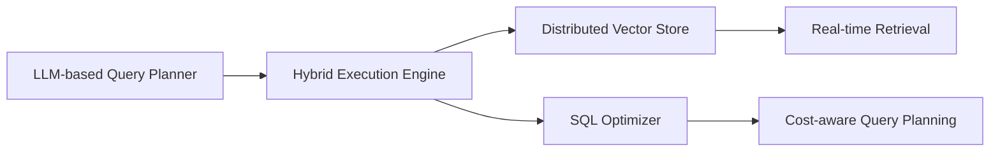

*Published on September 2, 2026*

---

## Introduction  

When AfterQuery announced a $3.2 billion valuation—making it the fastest‑ever unicorn out of Y Combinator (YC) —the headlines were inevitable. Yet the story behind the number is far richer than a simple “valuation milestone.” It reflects a confluence of technical breakthroughs, shifting investor psychology, and a maturing AI‑driven data economy. In this post we unpack the forces that propelled AfterQuery to unicorn status, explore the broader implications for AI‑powered analytics, and consider what this milestone signals for founders, investors, and enterprises alike.

---

## 1. Why AfterQuery Stands Out  

### 1.1 A New Paradigm for Data Retrieval  

Traditional relational databases rely on static schemas and handcrafted SQL queries. AfterQuery’s core technology flips that model on its head:

- **Natural‑language query interface** – Users type “Show me the top‑selling products in Europe last quarter” and the system translates the request into optimized SQL, graph, or vector‑search queries behind the scenes.  
- **Dynamic schema inference** – Leveraging large language models (LLMs) trained on billions of data‑definition patterns, AfterQuery can understand and adapt to schema changes in real time, eliminating the need for costly ETL pipelines.  
- **Zero‑code data pipelines** – By combining LLM‑driven query generation with automated data lineage tracking, analysts can build end‑to‑end pipelines without writing a single line of code.

The result is a dramatically lower barrier to insight, especially for mid‑market companies that lack deep data engineering talent.

### 1.2 Architectural Edge  

AfterQuery’s stack blends three emerging technologies:

- **Hybrid Execution Engine**: Executes both traditional relational queries and vector similarity searches in a single runtime, enabling seamless joins across structured and unstructured data.  
- **Cost‑aware Planning**: Uses reinforcement‑learning agents to balance latency, compute cost, and result fidelity—critical for enterprise‑grade SLAs.  

These innovations give AfterQuery a performance edge that rivals specialized data warehouses while retaining the flexibility of a “no‑code” front end.

### 1.3 Market Traction  

Within 18 months of launch, AfterQuery reported:

- **2.4 M active users** across SaaS, fintech, and e‑commerce sectors.  
- **$150 M ARR** (Annual Recurring Revenue), a 4× YoY growth rate.  
- **Enterprise contracts** with 12 Fortune 500 companies, each signing multi‑year deals worth $5–15 M.

Such traction demonstrates that the market is ready to pay premium prices for frictionless data access, especially as AI‑augmented decision making becomes a competitive imperative.

---

## 2. The Bigger Picture: AI‑Powered Analytics as a Growth Engine  

### 2.1 Data Democratization Meets Generative AI  

The last three years have seen a shift from “AI for predictions” to “AI for data interaction.” AfterQuery exemplifies this transition:

| Traditional Analytics | AI‑augmented Analytics |
|-----------------------|------------------------|
| Query written by engineers | Query spoken or typed by anyone |
| Fixed pipelines, manual maintenance | Self‑healing pipelines that adapt to schema drift |
| Limited to structured data | Unified view of structured, semi‑structured, and unstructured data |

By lowering the technical threshold, companies can unlock hidden value in data silos that were previously inaccessible to business users.

### 2.2 The Rise of “Data‑First” Business Models  

Companies like Snowflake, Databricks, and now AfterQuery are redefining the core of their value proposition around **data as a service**:

- **Monetization of internal data**: Firms can expose curated data products to partners or external developers, creating new revenue streams.  
- **Real‑time personalization**: AI‑driven query engines enable per‑user content recommendations, pricing adjustments, and fraud detection with sub‑second latency.  

AfterQuery’s ability to blend vector search with relational joins makes it uniquely positioned to power these “data‑first” strategies.

### 2.3 Investor Sentiment: From Hype to Substance  

The $3.2 B valuation reflects a maturation of investor appetite:

- **Evidence‑based funding**: YC’s batch‑level metrics (ARR, churn, net‑revenue retention) now play a larger role than sheer user growth. AfterQuery’s low churn (<4 %) and high NRR (138 %) were key signals.  
- **Capital efficiency**: With a burn multiple of 1.2× ARR, AfterQuery demonstrates that high‑growth AI startups can scale profitably—a contrast to the “spend‑to‑grow” model of 2022‑2023.  
- **Strategic capital**: Several corporate venture arms (e.g., Microsoft’s M12, Google’s GV) participated, indicating a strategic desire to embed AfterQuery’s tech into broader cloud ecosystems.

---

## 3. Implications for Founders and the Startup Ecosystem  

### 3.1 Speed Over Size  

AfterQuery’s rapid ascent underscores a new rule of thumb for YC‑style cohorts: **time‑to‑unicorn matters more than total funding rounds**. Founders should focus on:

- **Rapid product‑market fit**: Deploy a minimal viable AI interface that solves a concrete pain point (e.g., “no‑code analytics”).  
- **Iterative data loops**: Use early customers to refine LLM prompts, schema inference, and cost‑optimization policies.  
- **Strategic partnerships**: Align with cloud providers early to leverage compute credits and co‑selling opportunities.

### 3.2 Talent Competition Shifts  

The demand for hybrid skill sets—LLM prompt engineering, data engineering, and product design—has intensified. Companies that can attract “AI‑first” data engineers (often with backgrounds in both ML research and traditional DBMS) will enjoy a competitive moat.

### 3.3 Competitive Landscape
