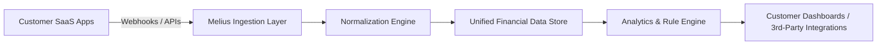

*By [Your Name]*  
*October 2026*

---

## Introduction  

When a startup decides to abandon its first product, the move is often seen as a setback—or even a sign that the venture is doomed. Yet for the former Ramp engineers behind **Melius**, that decision became the catalyst for a $20 million Series A round and a fresh strategic direction. In this post we’ll unpack what happened, why the pivot makes sense, and what other founders can learn from Melius’s journey.  

We’ll look beyond the headline to explore:

* The underlying market dynamics that pushed Melius to rethink its approach.  
* How a platform‑first mindset can unlock network effects and scalability.  
* The fundraising narrative that convinced investors to write a sizable check.  

By the end, you’ll have a clearer picture of how a well‑executed pivot can transform a fledgling startup from “almost there” to “ready to scale.”

---

## The Pivot: Why Scrapping the First Product Made Sense  

### 1. A Mismatch Between Vision and Execution  

The original Melius offering was a **B2B expense‑management tool** designed to compete directly with incumbents like Ramp, Brex, and SAP Concur. While the team’s deep domain expertise gave them a solid technical foundation, three critical issues emerged:

| Issue | Impact |
|-------|--------|
| **Feature Overload** | Early users complained that the UI was cluttered, making onboarding painful. |
| **Integration Gaps** | Enterprise customers required native connections to dozens of ERP and accounting systems—something the MVP couldn’t deliver. |
| **Pricing Pressure** | Competing on price with well‑funded rivals eroded margins and made sustainable unit economics elusive. |

Rather than iterating endlessly on a product that struggled to gain traction, the founders asked a hard question: *What problem were we truly solving for our customers?* The answer was not “expense reporting” but **“building a unified data layer for financial workflows.”**  

### 2. Listening to Early Adopters  

The team’s early pilot customers consistently requested a **single API** that could pull transaction data, reconcile accounts, and trigger downstream actions (e.g., approvals, alerts). This feedback highlighted a broader pain point: **fragmented financial data** across multiple SaaS tools.  

By scrapping the original product and refocusing on a **platform** that exposed a clean, extensible API, Melius could address a larger set of use cases—beyond expense management—to include cash‑flow forecasting, compliance monitoring, and automated bookkeeping.

### 3. The Cost of Persistence  

Continuing to pour resources into a product that required extensive UI redesign, deep integrations, and aggressive pricing would have drained cash reserves quickly. The pivot allowed the founders to:

* **Preserve runway** – shifting to a lean API‑first approach required fewer front‑end resources.  
* **Leverage existing tech** – the core data ingestion engine from the original product became the backbone of the new platform.  
* **Re‑align the team** – engineers could focus on building robust, reusable components rather than polishing a single UI.  

---

## Building a Platform Over a Product  

### What Makes a Platform Attractive?  

1. **Network Effects** – As more SaaS tools integrate with Melius, the value of each additional connection grows for all users.  
2. **Modularity** – Clients can pick and choose the services they need (e.g., real‑time transaction streaming, rule‑based alerts).  
3. **Scalability** – A well‑designed API can serve thousands of customers with minimal incremental cost.  

### Architectural Blueprint (Simplified)

* **Ingestion Layer** – Handles inbound data from ERP, payment processors, and expense tools.  
* **Normalization Engine** – Transforms disparate schemas into a canonical financial model.  
* **Unified Data Store** – A purpose‑built, columnar warehouse optimized for low‑latency queries.  
* **Analytics & Rule Engine** – Provides real‑time alerts, anomaly detection, and forecasting APIs.  

By exposing the **Analytics & Rule Engine** as a set of RESTful endpoints, Melius enables partners to build custom front‑ends or embed functionality directly into their own products.

### Go‑to‑Market Strategy  

| Phase | Target | Value Proposition |
|-------|--------|-------------------|
| **Beta** | FinTech startups | “Plug‑and‑play financial data layer – get to market 3× faster.” |
| **Growth** | Mid‑market enterprises | “Reduce manual reconciliation by 80 % and unlock real‑time cash visibility.” |
| **Scale** | Large enterprises & ISVs | “Enterprise‑grade security, compliance, and multi‑tenant architecture.” |

The platform model also opens **additional revenue streams**: subscription tiers based on API calls, premium analytics modules, and revenue sharing with ISVs that build on top of Melius.

---

## Funding Dynamics: Why $20 Million Made Sense  

### 1. Validation of the Pivot  

The $20 M round was led by **Accel** with participation from **Andreessen Horowitz** and **Founders Fund**—all firms with a track record of backing platform‑centric SaaS startups (e.g., Snowflake, Stripe). Their involvement signals two things:

* **Confidence in the market size** – The global spend on financial data integration is projected to exceed $15 B by 2029.  
* **Trust in the team’s execution** – The founders’ prior success at Ramp gave investors comfort that they could navigate the complexities of enterprise finance.

### 2. Capital Allocation  

The term sheet outlines a clear allocation plan:

| Category | % of Funds | Purpose |
|----------|------------|---------|
| **Engineering** | 45 % | Expand the ingestion layer, add new connectors (e.g., crypto wallets). |
|
